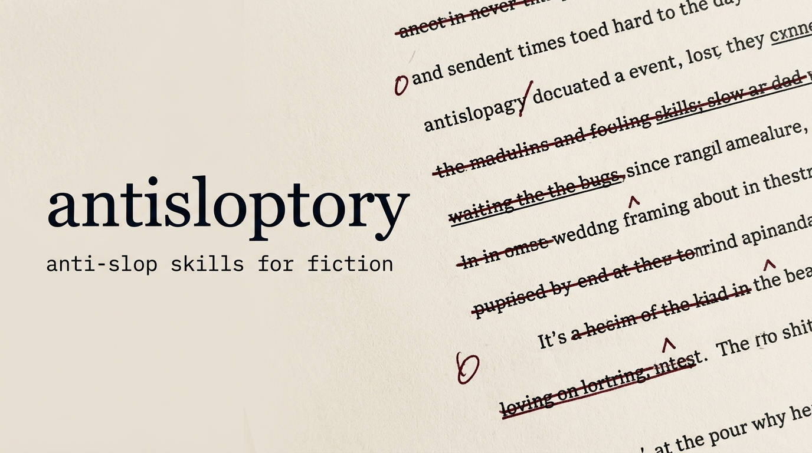

<p align="center">
  
</p>

<p align="center">
  <a href="LICENSE"></a>
  <a href="https://github.com/FadhilZidan/antisloptory/actions/workflows/ci.yml"></a>
  <a href="https://github.com/FadhilZidan/antisloptory/releases"></a>
  
</p>

<h1 align="center">antisloptory</h1>

<p align="center">
  Skill untuk agen AI yang membuang klise, prosa ungu, dialog terapi, dan khotbah moral dari fiksi.<br>
  Ini <strong>filter, bukan gaya</strong>: tidak ada suara pengarang yang dipaksakan. Plot dan suara tetap milik Anda.
</p>

## Lihat bedanya

Adegan yang sama, ditulis dua kali. Cuplikan dari [examples.md](skills/references/examples.md).

| Tanpa antisloptory | Dengan antisloptory |
|:--|:--|
| Rian mengembuskan napas yang tidak disadari telah ia tahan selama ini. Hawa dingin menjalar di tulang belakangnya saat pintu gudang tua itu berderit terbuka. Di sana berdiri Kevin. Senyum miring terukir di bibirnya. | Lampu merkuri di ujung gang padam sejak dua minggu lalu. Rian meraba dinding seng gudang untuk mencari pegangan; embun malam membuatnya licin dan berbau karat. Kevin duduk di atas peti kayu, menyalakan pemantik yang berderak tanpa api. Sekali. Dua kali. |
| *"Aku tahu trauma masa lalumu membuatmu merasa rentan, tapi balas dendam bukanlah jawabannya!"* | *"Kunci brankasnya nggak ada di rumah paman," kata Rian. Ujung sepatunya menendang serpihan botol sirup di lantai.* |
| Ia menyadari bahwa kemenangan sejati bukanlah tentang mengalahkan musuh, melainkan tentang berdamai dengan kegelapan di dalam diri kita sendiri. | Kevin mengeluarkan amplop cokelat tebal yang sudutnya sudah koyak, lalu melemparnya ke tumpukan karung semen di depan kaki Rian. |

Kolom kiri: napas tertahan, tulang belakang dingin, senyum miring, dialog konselor, dan paragraf hikmah. Kolom kanan: plotnya sama, tapi ketegangan datang dari benda, bau, dan apa yang tidak diucapkan.

## Modul

Tiga skill yang berdiri sendiri. Pakai satu, dua, atau ketiganya.

| Skill | Tugasnya | Pakai saat |
|:--|:--|:--|
| [`antislop-core`](skills/antislop-core/SKILL.md) | Diksi, klise fisiologis, kata filter, psikologi karakter, subteks dialog, penanda AI formulaik | Selalu. Ini filter dasarnya. |
| [`antislop-pacing`](skills/antislop-pacing/SKILL.md) | Ritme kalimat dan paragraf, geometri adegan, pergeseran kuasa, transisi | Adegan terasa datar atau terlalu rata panjang kalimatnya. |
| [`antislop-ending`](skills/antislop-ending/SKILL.md) | Potong dua kalimat terakhir, tolak resolusi rapi, tutup pada benda fisik | Menulis atau mengaudit penutup bab dan cerita. |

Dua berkas pendukung dipakai bersama oleh ketiga skill:

- [`anti-patterns.md`](skills/references/anti-patterns.md): daftar frasa terlarang, metafora basi, dan dialog klise (ID dan EN) beserta penggantinya.
- [`examples.md`](skills/references/examples.md): studi kasus sebelum dan sesudah.

## Pasang

### Installer (rekomendasi)

Butuh Node.js 18 atau lebih baru. Satu perintah, lalu pilih lokasi:

```bash
npx github:FadhilZidan/antisloptory
```

Installer menyalin ketiga skill beserta `references/` ke lokasi yang Anda pilih:

| Target | Lokasi |
|:--|:--|
| `global` | `~/.gemini/config/skills/` (Antigravity, semua proyek) |
| `workspace` | `.agents/skills/` (proyek saat ini) |
| `claude` | `~/.claude/skills/` (Claude Code) |
| `custom` | path pilihan Anda lewat `--dest` |

Tanpa prompt, misalnya untuk skrip:

```bash
npx github:FadhilZidan/antisloptory --target workspace
npx github:FadhilZidan/antisloptory --target custom --dest ./my-skills
npx github:FadhilZidan/antisloptory --dry-run   # lihat apa yang akan disalin
```

### Claude Code (plugin)

```text
/plugin marketplace add FadhilZidan/antisloptory
/plugin install antisloptory@antisloptory
```

### Manual

Clone repo ini, lalu salin folder yang dibutuhkan. Salin `skills/references/` juga, karena ketiga skill merujuk ke sana.

| Agen | Caranya |
|:--|:--|
| Google Antigravity | Salin `skills/*` ke `~/.gemini/config/skills/` atau `<proyek>/.agents/skills/`. |
| Claude Code | Salin `skills/*` ke `~/.claude/skills/`. |
| Cursor | Tempel isi `SKILL.md` ke `.cursor/rules/antislop-fiction.mdc` atau `.cursorrules`. |
| Windsurf | Tempel isi `SKILL.md` ke `.windsurfrules`. |
| Copilot dan agen lain | Tempel isi `SKILL.md` ke `AGENTS.md`. |
| ChatGPT (Custom GPT / Project) | Tempel `antislop-core/SKILL.md` dan `references/anti-patterns.md` ke kolom *Instructions*. |

### Perbarui dan hapus

Jalankan installer lagi untuk memperbarui; berkas lama ditimpa. Untuk menghapus, buang folder `antislop-core`, `antislop-pacing`, `antislop-ending`, dan `references` dari lokasi pemasangan.

## Pakai

Agen yang mendukung skill akan memuatnya sendiri saat percakapan menyentuh penulisan fiksi. Menyebut nama modul membuatnya lebih pasti:

> Tulis adegan pembuka cerita kriminal di pelabuhan Tanjung Priok, 1998. Pakai **antislop-core** dan **antislop-pacing**. Tokoh utamanya punya motif egois.

> Periksa penutup bab ini dengan **antislop-ending**. Kalau ada paragraf khotbah, hapus, dan tutup pada benda fisik: [tempel teks]

> Audit naskah ini dengan **antislop-core**. Daftar dulu temuannya, jangan langsung ubah.

## Struktur repo

```text
antisloptory/
├── skills/
│   ├── antislop-core/SKILL.md      # filter dasar: diksi, karakter, dialog
│   ├── antislop-pacing/SKILL.md    # ritme, adegan, transisi
│   ├── antislop-ending/SKILL.md    # penutup tanpa khotbah
│   └── references/
│       ├── anti-patterns.md        # daftar frasa terlarang + pengganti
│       └── examples.md             # sebelum vs sesudah
├── scripts/
│   ├── installer.mjs               # installer npx
│   └── check-repo.mjs              # validasi yang dijalankan CI
├── .claude-plugin/                 # manifest plugin Claude Code
├── .github/                        # CI, template issue dan PR
└── assets/                         # gambar README
```

## Kontribusi

Menemukan klise AI yang belum tercatat? Itu kontribusi paling berguna. Buka issue dengan template **Laporan pola slop**, atau baca [CONTRIBUTING.md](CONTRIBUTING.md) untuk mengirim PR. Riwayat perubahan ada di [CHANGELOG.md](CHANGELOG.md).

Proyek ini mengikuti [Kode Etik](CODE_OF_CONDUCT.md). Untuk masalah keamanan, lihat [SECURITY.md](SECURITY.md).

## Lisensi

[MIT](LICENSE) © 2026 Muhammad Fadhil Zidan Marpaung
